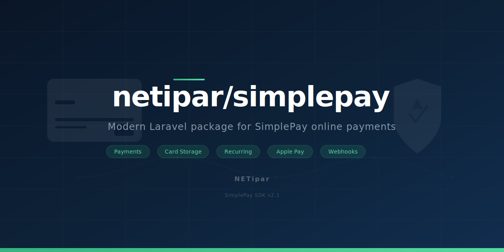

<picture>
  <source media="(prefers-color-scheme: dark)" srcset="art/banner.svg">
  
</picture>

# SimplePay for Laravel

[](https://packagist.org/packages/netipar/simplepay)
[](https://github.com/NETipar/simplepay/actions?query=workflow%3ATests+branch%3Amain)
[](https://packagist.org/packages/netipar/simplepay)

Modern Laravel package for [SimplePay](https://simplepay.hu) online payment integration. Start payments, handle IPN webhooks, manage card storage, process refunds, and more.

Based on the official [SimplePay PHP SDK](https://simplepay.hu/fejlesztoknek/) v2.1, rebuilt for Laravel with typed DTOs, Enums, Events, and full API coverage.

## Quick Example

```php
use Netipar\SimplePay\Facades\SimplePay;
use Netipar\SimplePay\Enums\Currency;
use Netipar\SimplePay\Enums\PaymentMethod;
use Netipar\SimplePay\Dto\PaymentRequest;
use Netipar\SimplePay\Dto\Address;

$response = SimplePay::payment()->start(new PaymentRequest(
    currency: Currency::HUF,
    total: 2500,
    orderRef: 'ORDER-123',
    customerEmail: 'customer@example.com',
    language: 'HU',
    url: route('simplepay.back'),
    methods: [PaymentMethod::CARD],
    invoice: new Address(
        name: 'John Doe',
        country: 'hu',
        city: 'Budapest',
        zip: '1111',
        address: 'Main Street 1',
    ),
));

return redirect($response->paymentUrl);
```

## Requirements

- PHP 8.2+
- Laravel 11 or 12
- A [SimplePay](https://simplepay.hu) merchant account

## Installation

```bash
composer require netipar/simplepay
```

Publish the config file:

```bash
php artisan vendor:publish --tag=simplepay-config
```

Add your merchant credentials to `.env`:

```
SIMPLEPAY_SANDBOX=true
SIMPLEPAY_HUF_MERCHANT=your_merchant_id
SIMPLEPAY_HUF_SECRET_KEY=your_secret_key
SIMPLEPAY_BACK_URL=https://yourdomain.com/payment/back
```

## Usage

### Obtaining the Services

Access all services through the `SimplePay` facade:

```php
use Netipar\SimplePay\Facades\SimplePay;

SimplePay::payment();      // PaymentService
SimplePay::cardStorage();  // CardStorageService
SimplePay::autoPayment();  // AutoPaymentService
SimplePay::rtp();          // RtpService
```

### Start a Payment

```php
use Netipar\SimplePay\Facades\SimplePay;
use Netipar\SimplePay\Enums\Currency;
use Netipar\SimplePay\Enums\PaymentMethod;
use Netipar\SimplePay\Dto\PaymentRequest;
use Netipar\SimplePay\Dto\Address;
use Netipar\SimplePay\Dto\Item;

$response = SimplePay::payment()->start(new PaymentRequest(
    currency: Currency::HUF,
    total: 25400,
    orderRef: 'ORDER-2026-001',
    customerEmail: 'customer@example.com',
    language: 'HU',
    url: route('simplepay.back'),
    methods: [PaymentMethod::CARD],
    invoice: new Address(
        name: 'Customer Kft.',
        country: 'hu',
        city: 'Budapest',
        zip: '1234',
        address: 'Main Street 1.',
    ),
    items: [
        new Item(
            title: 'Product name',
            price: 10000,
            quantity: 2,
        ),
        new Item(
            title: 'Delivery',
            price: 5400,
            quantity: 1,
        ),
    ],
));

$response->transactionId; // SimplePay transaction ID
$response->paymentUrl;    // Redirect URL to SimplePay payment page
$response->timeout;       // Payment timeout

return redirect($response->paymentUrl);
```

### Two-Step Payment (Authorize + Finish)

```php
use Netipar\SimplePay\Dto\PaymentRequest;
use Netipar\SimplePay\Dto\FinishRequest;

// Step 1: Authorize with twoStep enabled
$response = SimplePay::payment()->start(new PaymentRequest(
    // ... same as above
    twoStep: true,
));

// Step 2: Later, finish the authorized payment
$result = SimplePay::payment()->finish(new FinishRequest(
    currency: Currency::HUF,
    transactionId: $transactionId,
    orderRef: 'ORDER-2026-001',
    approveTotal: 25400,
));
```

### Refund a Transaction

```php
use Netipar\SimplePay\Dto\RefundRequest;

// Full refund
$result = SimplePay::payment()->refund(new RefundRequest(
    currency: Currency::HUF,
    transactionId: $transactionId,
    orderRef: 'ORDER-2026-001',
    refundTotal: 25400,
));

// Partial refund
$result = SimplePay::payment()->refund(new RefundRequest(
    currency: Currency::HUF,
    transactionId: $transactionId,
    orderRef: 'ORDER-2026-001',
    refundTotal: 10000,
));
```

### Query Transaction Status

```php
$result = SimplePay::payment()->query(
    currency: Currency::HUF,
    transactionId: $transactionId,
);

$result->status;         // PaymentStatus enum
$result->remainingTotal; // Remaining amount
$result->paymentDate;    // Payment date
$result->finishDate;     // Finish date (two-step)
```

### Cancel a Transaction

```php
SimplePay::payment()->cancel(
    currency: Currency::HUF,
    transactionId: $transactionId,
);
```

### Card Storage (OneClick Payments)

```php
use Netipar\SimplePay\Dto\CardStorageDoRequest;

// Pay with a stored card
$result = SimplePay::cardStorage()->do(new CardStorageDoRequest(
    currency: Currency::HUF,
    total: 5000,
    orderRef: 'ORDER-2026-002',
    customerEmail: 'customer@example.com',
    cardId: $savedCardId,
));

// Query stored card
$card = SimplePay::cardStorage()->cardQuery(Currency::HUF, $cardId);

// Remove stored card
SimplePay::cardStorage()->cardCancel(Currency::HUF, $cardId);
```

### Recurring Payments

```php
use Netipar\SimplePay\Dto\RecurringRequest;

$result = SimplePay::cardStorage()->doRecurring(new RecurringRequest(
    currency: Currency::HUF,
    total: 9900,
    orderRef: 'SUB-2026-003',
    customerEmail: 'customer@example.com',
    token: $recurringToken,
));
```

### Apple Pay

```php
use Netipar\SimplePay\Dto\ApplePayStartRequest;
use Netipar\SimplePay\Dto\ApplePayDoRequest;

// Start Apple Pay session
$session = SimplePay::payment()->startApplePay(new ApplePayStartRequest(
    currency: Currency::HUF,
    total: 5000,
    orderRef: 'ORDER-AP-001',
    customerEmail: 'customer@example.com',
));

// Complete Apple Pay payment
$result = SimplePay::payment()->doApplePay(new ApplePayDoRequest(
    currency: Currency::HUF,
    transactionId: $session->transactionId,
    applePayToken: $tokenFromJs,
));
```

### EAM / Qvik Payment

```php
use Netipar\SimplePay\Dto\EamStartRequest;

$response = SimplePay::payment()->startEam(new EamStartRequest(
    currency: Currency::HUF,
    total: 3000,
    orderRef: 'ORDER-EAM-001',
    customerEmail: 'customer@example.com',
    url: route('simplepay.back'),
));
```

### Request to Pay (RTP)

```php
use Netipar\SimplePay\Dto\RtpStartRequest;

// Start RTP transaction
$result = SimplePay::rtp()->start(new RtpStartRequest(
    currency: Currency::HUF,
    total: 15000,
    orderRef: 'RTP-2026-001',
    customerEmail: 'customer@example.com',
    url: route('simplepay.back'),
));

// Query RTP status
$status = SimplePay::rtp()->query(Currency::HUF, transactionId: $id);

// Refund RTP
SimplePay::rtp()->refund(Currency::HUF, $transactionId, 15000);

// Reverse RTP
SimplePay::rtp()->reverse(Currency::HUF, $transactionId);
```

## IPN Webhook

The package automatically registers a `POST /simplepay/ipn` route with signature verification middleware. Listen to payment events in your application:

```php
// In EventServiceProvider or via Event::listen()
use Netipar\SimplePay\Events\PaymentSucceeded;
use Netipar\SimplePay\Events\PaymentFailed;

protected $listen = [
    PaymentSucceeded::class => [HandlePaymentSuccess::class],
    PaymentFailed::class => [HandlePaymentFailure::class],
];
```

Available events (all receive `IpnMessage` DTO):

| Event | Trigger |
|---|---|
| `IpnReceived` | Every IPN notification |
| `PaymentSucceeded` | FINISHED status |
| `PaymentAuthorized` | AUTHORIZED (two-step) |
| `PaymentFailed` | NOTAUTHORIZED |
| `PaymentCancelled` | CANCELLED |
| `PaymentTimedOut` | TIMEOUT |
| `PaymentRefunded` | REFUND |

The `IpnMessage` DTO contains:

```php
$event->ipnMessage->orderRef;       // Your order reference
$event->ipnMessage->transactionId;  // SimplePay transaction ID
$event->ipnMessage->status;         // PaymentStatus enum
$event->ipnMessage->paymentMethod;  // PaymentMethod enum
$event->ipnMessage->cardMask;       // Masked card number
```

## Back URL Handling

The package registers a `GET /simplepay/back` route. Customize the response by binding your own `BackUrlResponse` in `AppServiceProvider`:

```php
use Netipar\SimplePay\Contracts\BackUrlResponse;
use App\Http\Responses\SimplePayBackResponse;

// AppServiceProvider::register()
$this->app->singleton(BackUrlResponse::class, SimplePayBackResponse::class);
```

```php
use Netipar\SimplePay\Contracts\BackUrlResponse;
use Netipar\SimplePay\Dto\BackResponse;
use Netipar\SimplePay\Enums\BackEvent;

class SimplePayBackResponse implements BackUrlResponse
{
    public function toResponse(Request $request, BackResponse $back): Response
    {
        return match ($back->event) {
            BackEvent::Success => redirect()->route('payment.success', $back->orderRef),
            BackEvent::Fail    => redirect()->route('payment.failed'),
            BackEvent::Cancel  => redirect()->route('checkout'),
            BackEvent::Timeout => redirect()->route('payment.timeout'),
        };
    }
}
```

## Enums

Always use enum cases instead of raw strings:

- **`Currency`** -- `HUF`, `EUR`, `USD`
- **`PaymentMethod`** -- `CARD`, `WIRE`, `EAM`
- **`PaymentStatus`** -- `INIT`, `FINISHED`, `AUTHORIZED`, `NOTAUTHORIZED`, `INPAYMENT`, `CANCELLED`, `TIMEOUT`, `INFRAUD`, `FRAUD`, `REFUND`, `REVERSED`
- **`BackEvent`** -- `SUCCESS`, `FAIL`, `CANCEL`, `TIMEOUT`
- **`TransactionType`** -- `CIT` (Customer Initiated), `MIT` (Merchant Initiated), `REC` (Recurring)
- **`ErrorCode`** -- 358+ error codes with Hungarian descriptions

## Error Handling

The package throws `SimplePayApiException` when the SimplePay API returns error codes:

```php
use Netipar\SimplePay\Exceptions\SimplePayApiException;

try {
    $response = SimplePay::payment()->start($request);
} catch (SimplePayApiException $e) {
    $e->getMessage();       // "[5083] Token times szükséges"
    $e->getErrorCodes();    // [5083]
    $e->hasErrorCode(5083); // true
    $e->getResolvedCodes(); // [ErrorCode::TokenTimesRequired]
}
```

## Configuration

Key `.env` variables:

```
SIMPLEPAY_SANDBOX=true
SIMPLEPAY_HUF_MERCHANT=your_merchant_id
SIMPLEPAY_HUF_SECRET_KEY=your_secret_key
SIMPLEPAY_BACK_URL=https://yourdomain.com/payment/back
SIMPLEPAY_TIMEOUT=600
SIMPLEPAY_LOG_CHANNEL=simplepay
SIMPLEPAY_AUTO_CHALLENGE=true
```

Multi-currency support -- each currency has its own merchant credentials:

```
SIMPLEPAY_EUR_MERCHANT=your_eur_merchant_id
SIMPLEPAY_EUR_SECRET_KEY=your_eur_secret_key
SIMPLEPAY_USD_MERCHANT=your_usd_merchant_id
SIMPLEPAY_USD_SECRET_KEY=your_usd_secret_key
```

## Logging

Set `SIMPLEPAY_LOG_CHANNEL` to any Laravel log channel name. Example dedicated channel in `config/logging.php`:

```php
'simplepay' => [
    'driver' => 'daily',
    'path' => storage_path('logs/simplepay.log'),
    'days' => 14,
],
```

## Services Overview

| Service | Access | Purpose |
|---|---|---|
| `PaymentService` | `SimplePay::payment()` | Standard payments, refunds, queries, Apple Pay, EAM |
| `CardStorageService` | `SimplePay::cardStorage()` | OneClick, recurring, card/token management |
| `AutoPaymentService` | `SimplePay::autoPayment()` | PCI-DSS direct card payments |
| `RtpService` | `SimplePay::rtp()` | Request to Pay (bank transfers) |

## SDK Compatibility

This package is built based on the **SimplePay PHP SDK v2.1** (API v2). All API requests include the `sdkVersion: SimplePay_PHP_SDK_2.1_Laravel` identifier.

## Examples

- [English examples](examples/en/)
- [Magyar példák](examples/hu/)

## Testing

```bash
composer test
```

## Credits

- [NETipar](https://netipar.hu)

## License

The MIT License (MIT). Please see [License File](LICENSE.md) for more information.
